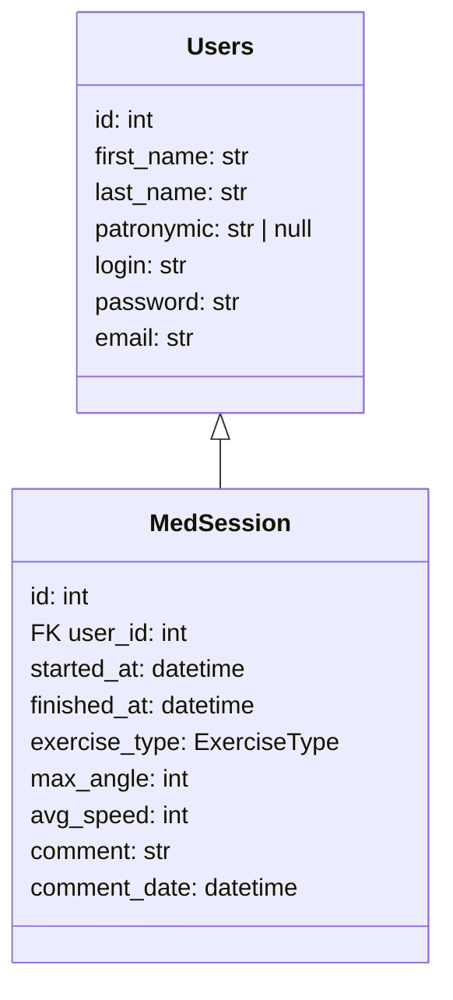

# Справка по устройству БД
## <sapn style="color:green">Таблицы:
- Users
- MedSession

```mermaid
classDiagram
      Users <|-- MedSession
      class Users{
          id: int
          first_name: str
          last_name: str
          patronymic: str | null
          login: str
          password: str
          email: str
      }
      class MedSession{
          
          id: int
          FK user_id: int
          started_at: datetime
          finished_at: datetime
          exercise_type: ExerciseType
          max_angle: int
          avg_speed: int
          comment: str
          comment_date: datetime
      }
     
```
